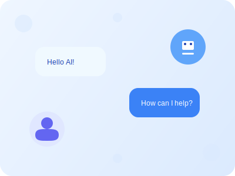
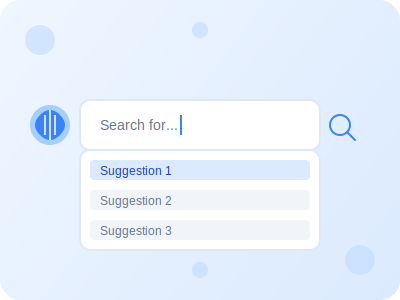
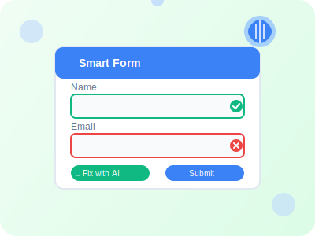
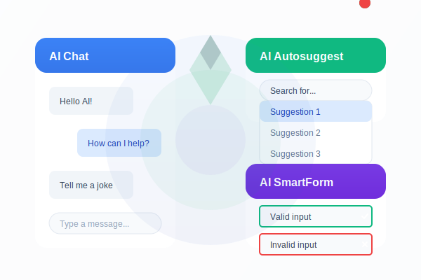

<div align="center">
  

  <h1>VueAI - Modern AI Components for Vue.js</h1>

  <p>
    <a href="https://www.npmjs.com/package/@aivue/core"></a>
    <a href="https://www.npmjs.com/package/@aivue/core"></a>
    <a href="https://www.npmjs.com/package/@aivue/core"></a>
    <a href="https://github.com/reachbrt/vueai/blob/main/LICENSE"></a>
    <a href="https://codecov.io/gh/reachbrt/vueai"></a>
    <a href="https://aivue.netlify.app/"></a>
  </p>

  <p><a href="https://aivue.netlify.app/" target="_blank">📺 Live Demo</a> • <a href="https://github.com/reachbrt/vueai/wiki" target="_blank">📚 Documentation</a> • <a href="https://github.com/reachbrt/vueai/issues/new" target="_blank">🐛 Report Bug</a></p>
</div>

## ✨ Features

A modular AI-powered Vue.js component suite that enhances your applications with intelligent capabilities:

<table>
  <tr>
    <td align="center" width="16.66%">
      <br>
      <a href="https://www.npmjs.com/package/@aivue/chatbot"><b>@aivue/chatbot</b></a><br>
      <small>Multi-provider AI chat widget</small>
    </td>
    <td align="center" width="16.66%">
      <br>
      <a href="https://www.npmjs.com/package/@aivue/autosuggest"><b>@aivue/autosuggest</b></a><br>
      <small>Smart autosuggest with semantic ranking</small>
    </td>
    <td align="center" width="16.66%">
      <br>
      <a href="https://www.npmjs.com/package/@aivue/smartform"><b>@aivue/smartform</b></a><br>
      <small>AI-enhanced forms with dynamic validation</small>
    </td>
    <td align="center" width="16.66%">
      <br>
      <a href="https://www.npmjs.com/package/@aivue/image-caption"><b>@aivue/image-caption</b></a><br>
      <small>AI-powered image captioning</small>
    </td>
    <td align="center" width="16.66%">
      <br>
      <a href="https://www.npmjs.com/package/@aivue/emotion-ui"><b>@aivue/emotion-ui</b></a><br>
      <small>Emotion-aware UI components</small>
    </td>
    <td align="center" width="16.66%">
      <br>
      <a href="https://www.npmjs.com/package/@aivue/doc-intelligence"><b>@aivue/doc-intelligence</b></a><br>
      <small>Document processing with OCR</small>
    </td>
  </tr>
  <tr>
    <td align="center" width="16.66%">
      <br>
      <a href="https://www.npmjs.com/package/@aivue/predictive-input"><b>@aivue/predictive-input</b></a><br>
      <small>AI-powered text predictions</small>
    </td>
    <td align="center" width="16.66%">
      <br>
      <a href="https://www.npmjs.com/package/@aivue/smart-notify"><b>@aivue/smart-notify</b></a><br>
      <small>Intelligent notifications</small>
    </td>
    <td align="center" width="16.66%">
      <br>
      <a href="https://www.npmjs.com/package/@aivue/voice-actions"><b>@aivue/voice-actions</b></a><br>
      <small>Voice command integration</small>
    </td>
    <td align="center" width="16.66%">
      <br>
      <a href="https://www.npmjs.com/package/@aivue/analytics"><b>@aivue/analytics</b></a><br>
      <small>AI-powered analytics</small>
    </td>
    <td align="center" width="16.66%">
      <br>
      <a href="https://www.npmjs.com/package/@aivue/core"><b>@aivue/core</b></a><br>
      <small>Core AI functionality</small>
    </td>
    <td align="center" width="16.66%">
      <br>
      <a href="https://www.npmjs.com/package/@aivue/smart-datatable"><b>@aivue/smart-datatable</b></a><br>
      <small>AI-native data table</small>
    </td>
  </tr>
  <tr>
    <td align="center" width="16.66%">
      <br>
      <a href="https://www.npmjs.com/package/@aivue/360-spin"><b>@aivue/360-spin</b></a><br>
      <small>360° product viewer</small>
    </td>
    <td align="center" width="16.66%">
    </td>
    <td align="center" width="16.66%">
    </td>
    <td align="center" width="16.66%">
    </td>
    <td align="center" width="16.66%">
    </td>
    <td align="center" width="16.66%">
    </td>
  </tr>
</table>

## 🚀 Quick Start

### 📦 Installation

<table>
<tr>
<td>

```bash
# Install the core package
npm install @aivue/core

# Install component packages as needed
npm install @aivue/chatbot
npm install @aivue/autosuggest
npm install @aivue/smartform
npm install @aivue/image-caption
npm install @aivue/emotion-ui
npm install @aivue/doc-intelligence
npm install @aivue/predictive-input
npm install @aivue/smart-notify
npm install @aivue/voice-actions
npm install @aivue/analytics
npm install @aivue/smart-datatable
npm install @aivue/360-spin

# Or install all packages at once
npm install @aivue/core @aivue/chatbot @aivue/autosuggest @aivue/smartform @aivue/image-caption @aivue/emotion-ui @aivue/doc-intelligence @aivue/predictive-input @aivue/smart-notify @aivue/voice-actions @aivue/analytics @aivue/smart-datatable @aivue/360-spin
```

</td>
<td>

**Key Benefits:**
- 🔌 Plug-n-play Vue 3 & Nuxt support
- 🛡️ SOC2-ready AI APIs with multiple provider options
- 🌐 Works with or without API keys during development
- 🎬 YouTube + Replit templates

</td>
</tr>
</table>

### 🔑 API Key Setup

<div class="api-key-setup">
  <div class="setup-steps">
    <ol>
      <li>Create a <code>.env</code> file in your project root (this file will be automatically excluded from Git)</li>
      <li>Add your API keys for the providers you want to use:</li>
    </ol>
  </div>

  <div class="code-example">

```bash
# OpenAI API Key
VITE_OPENAI_API_KEY=your_openai_api_key_here

# Claude API Key (optional)
VITE_CLAUDE_API_KEY=your_claude_api_key_here

# Gemini API Key (optional)
VITE_GEMINI_API_KEY=your_gemini_api_key_here

# HuggingFace API Key (optional)
VITE_HUGGINGFACE_API_KEY=your_huggingface_api_key_here

# DeepSeek API Key (optional)
VITE_DEEPSEEK_API_KEY=your_deepseek_api_key_here
```

  </div>
</div>

> **Note:** If you don't have API keys, the components will still work using the fallback provider which simulates AI responses.

---

## 🏗️ Structure
```
vueai/
├── packages/
│   ├── core/              # @aivue/core
│   │   ├── src/
│   │   │   ├── index.ts
│   │   │   └── providers/
│   │   │       ├── openai.ts
│   │   │       ├── claude.ts
│   │   │       ├── gemini.ts
│   │   │       ├── huggingface.ts
│   │   │       ├── ollama.ts
│   │   │       ├── deepseek.ts
│   │   │       └── fallback.ts
│   ├── chatbot/           # @aivue/chatbot
│   ├── autosuggest/       # @aivue/autosuggest
│   ├── smartform/         # @aivue/smartform
│   ├── image-caption/     # @aivue/image-caption
│   ├── emotion-ui/        # @aivue/emotion-ui
│   ├── doc-intelligence/  # @aivue/doc-intelligence
│   ├── predictive-input/  # @aivue/predictive-input
│   ├── smart-notify/      # @aivue/smart-notify
│   ├── voice-actions/     # @aivue/voice-actions
│   ├── analytics/         # @aivue/analytics
│   ├── smart-datatable/   # @aivue/smart-datatable
│   └── 360-spin/          # @aivue/360-spin
├── demo/                  # Live demo application
└── package.json           # Root package.json with workspace configuration
```

---

## 📦 Component Packages

<div class="component-cards">
  <div class="component-card">
    <div class="card-header">
      
      <h3>@aivue/chatbot <a href="https://www.npmjs.com/package/@aivue/chatbot"></a> <a href="https://www.npmjs.com/package/@aivue/chatbot"></a></h3>
    </div>
    <div class="card-features">
      <ul>
        <li>✅ Multi-provider support (OpenAI, Claude, Gemini, HuggingFace, Ollama, DeepSeek)</li>
        <li>✅ Automatic fallback when API keys aren't available</li>
        <li>✅ Streaming responses with Markdown support</li>
        <li>✅ File upload, PDF parsing, history tracking</li>
        <li>✅ "Fix with AI" feature for automatic corrections</li>
      </ul>
    </div>
    <div class="card-code">

```vue
<template>
  <AiChatWindow
    :client="aiClient"
    title="AI Assistant"
    placeholder="Ask me anything..."
    :show-avatars="true"
    theme="light"
    :streaming="true"
    :markdown="true"
    system-prompt="You are a helpful AI assistant."
  />
</template>

<script setup>
import { AIClient } from '@aivue/core';
import { AiChatWindow } from '@aivue/chatbot';
import '@aivue/chatbot/style.css';

const aiClient = new AIClient({
  provider: 'openai',
  apiKey: import.meta.env.VITE_OPENAI_API_KEY,
  model: 'gpt-4o'
});
</script>
```

  </div>
  </div>

  <div class="component-card">
    <div class="card-header">
      
      <h3>@aivue/autosuggest <a href="https://www.npmjs.com/package/@aivue/autosuggest"></a> <a href="https://www.npmjs.com/package/@aivue/autosuggest"></a></h3>
    </div>
    <div class="card-features">
      <ul>
        <li>✅ AI-powered results with semantic sort</li>
        <li>✅ Multi-provider support with automatic fallback</li>
        <li>✅ Contextual suggestions based on domain</li>
        <li>✅ Customizable UI and behavior</li>
      </ul>
    </div>
    <div class="card-code">

```vue
<template>
  <AiAutosuggest
    :client="aiClient"
    v-model="query"
    placeholder="Search..."
    :debounce="300"
    :context="'Vue.js components and libraries'"
    @select="handleSelect"
  />
</template>

<script setup>
import { ref } from 'vue';
import { AIClient } from '@aivue/core';
import { AiAutosuggest } from '@aivue/autosuggest';

const query = ref('');
const aiClient = new AIClient({
  provider: 'openai',
  apiKey: import.meta.env.VITE_OPENAI_API_KEY,
  model: 'gpt-4o'
});

function handleSelect(suggestion) {
  console.log('Selected:', suggestion);
}
</script>
```

  </div>
  </div>

  <div class="component-card">
    <div class="card-header">
      
      <h3>@aivue/smartform <a href="https://www.npmjs.com/package/@aivue/smartform"></a> <a href="https://www.npmjs.com/package/@aivue/smartform"></a></h3>
    </div>
    <div class="card-features">
      <ul>
        <li>✅ AI-powered validation + dynamic healing</li>
        <li>✅ Multi-provider support with automatic fallback</li>
        <li>✅ Intelligent form field suggestions</li>
        <li>✅ "Fix with AI" feature for automatic corrections</li>
      </ul>
    </div>
    <div class="card-code">

```vue
<template>
  <AiSmartForm
    :client="aiClient"
    :schema="formSchema"
    validation="ai"
    @submit="handleSubmit"
  />
</template>

<script setup>
import { ref } from 'vue';
import { AIClient } from '@aivue/core';
import { AiSmartForm } from '@aivue/smartform';

const aiClient = new AIClient({
  provider: 'openai',
  apiKey: import.meta.env.VITE_OPENAI_API_KEY
});

const formSchema = ref({
  fields: [
    {
      name: 'email',
      label: 'Email',
      type: 'email',
      required: true
    },
    {
      name: 'description',
      label: 'Description',
      type: 'textarea',
      required: true,
      minLength: 50
    }
  ]
});

function handleSubmit(data) {
  console.log('Form submitted:', data);
}
</script>
```

  </div>
  </div>

  <div class="component-card">
    <div class="card-header">
      
      <h3>@aivue/image-caption <a href="https://www.npmjs.com/package/@aivue/image-caption"></a> <a href="https://www.npmjs.com/package/@aivue/image-caption"></a></h3>
    </div>
    <div class="card-features">
      <ul>
        <li>✅ OpenAI Vision models (GPT-4o, GPT-4o Mini, GPT-4 Turbo)</li>
        <li>✅ Drag & drop image upload with preview</li>
        <li>✅ URL support for remote images</li>
        <li>✅ Batch processing for multiple images</li>
        <li>✅ History tracking and export functionality</li>
      </ul>
    </div>
    <div class="card-code">

```vue
<template>
  <AiImageCaption
    :api-key="apiKey"
    :model="'gpt-4o'"
    @caption-generated="handleCaption"
    @caption-error="handleError"
  />
</template>

<script setup>
import { AiImageCaption } from '@aivue/image-caption';
import '@aivue/image-caption/dist/image-caption.css';

const apiKey = import.meta.env.VITE_OPENAI_API_KEY;

function handleCaption(result) {
  console.log('Generated caption:', result.caption);
}

function handleError(error) {
  console.error('Caption error:', error);
}
</script>
```

  </div>
  </div>

  <div class="component-card">
    <div class="card-header">
      
      <h3>@aivue/analytics <a href="https://www.npmjs.com/package/@aivue/analytics"></a> <a href="https://www.npmjs.com/package/@aivue/analytics"></a></h3>
    </div>
    <div class="card-features">
      <ul>
        <li>✅ Real-time analytics and insights dashboard</li>
        <li>✅ AI-powered conversation analysis</li>
        <li>✅ Performance monitoring and error tracking</li>
        <li>✅ Beautiful charts and visualizations</li>
        <li>✅ Privacy-first with local storage by default</li>
      </ul>
    </div>
    <div class="card-code">

```vue
<template>
  <div>
    <!-- Analytics Dashboard -->
    <AiAnalyticsDashboard
      :ai-client="aiClient"
      :show-conversation-analytics="true"
    />

    <!-- Track interactions automatically -->
    <button v-analytics="{ component: 'my-app', action: 'click' }">
      Click me
    </button>
  </div>
</template>

<script setup>
import { AiAnalyticsDashboard, useAnalytics, vAnalytics } from '@aivue/analytics';
import { AIClient } from '@aivue/core';

const aiClient = new AIClient({
  provider: 'openai',
  apiKey: import.meta.env.VITE_OPENAI_API_KEY
});

// Set up analytics
const analytics = useAnalytics({
  config: { enabled: true, trackInteractions: true },
  aiClient
});
</script>
```

  </div>
  </div>

  <div class="component-card">
    <div class="card-header">
      
      <h3>@aivue/emotion-ui <a href="https://www.npmjs.com/package/@aivue/emotion-ui"></a> <a href="https://www.npmjs.com/package/@aivue/emotion-ui"></a></h3>
    </div>
    <div class="card-features">
      <ul>
        <li>✅ Real-time emotion detection from text input</li>
        <li>✅ Sentiment analysis with AI-powered insights</li>
        <li>✅ Emotion-aware UI components (inputs, buttons, notifications)</li>
        <li>✅ Adaptive styling based on detected emotions</li>
        <li>✅ Facial and voice analysis support</li>
      </ul>
    </div>
    <div class="card-code">

```vue
<template>
  <div>
    <EmotionAwareInput
      v-model="message"
      placeholder="Type your message..."
      @emotion-detected="handleEmotion"
    />
    <EmotionAwareButton
      :emotion="currentEmotion"
      @click="handleSubmit"
    >
      Send Message
    </EmotionAwareButton>
  </div>
</template>

<script setup>
import { ref } from 'vue';
import { EmotionAwareInput, EmotionAwareButton, useEmotionStore } from '@aivue/emotion-ui';
import '@aivue/emotion-ui/style.css';

const message = ref('');
const emotionStore = useEmotionStore();
const currentEmotion = computed(() => emotionStore.currentEmotion);

function handleEmotion(emotion) {
  console.log('Detected emotion:', emotion);
}

function handleSubmit() {
  console.log('Message:', message.value);
}
</script>
```

  </div>
  </div>

  <div class="component-card">
    <div class="card-header">
      
      <h3>@aivue/doc-intelligence <a href="https://www.npmjs.com/package/@aivue/doc-intelligence"></a> <a href="https://www.npmjs.com/package/@aivue/doc-intelligence"></a></h3>
    </div>
    <div class="card-features">
      <ul>
        <li>✅ OCR text extraction from PDFs and images</li>
        <li>✅ Document type detection (invoice, receipt, ID, etc.)</li>
        <li>✅ Entity extraction (dates, amounts, emails, etc.)</li>
        <li>✅ Auto-generated forms from extracted data</li>
        <li>✅ Support for multiple document formats</li>
      </ul>
    </div>
    <div class="card-code">

```vue
<template>
  <div>
    <DocumentUpload
      @document-uploaded="handleUpload"
      :accepted-types="['pdf', 'jpg', 'png']"
    />
    <DocumentViewer
      v-if="document"
      :document="document"
      :extracted-text="extractedText"
    />
    <ExtractedDataForm
      v-if="extractedData"
      :data="extractedData"
      @submit="handleSubmit"
    />
  </div>
</template>

<script setup>
import { ref } from 'vue';
import { DocumentUpload, DocumentViewer, ExtractedDataForm, useDocIntelligence } from '@aivue/doc-intelligence';
import '@aivue/doc-intelligence/style.css';

const document = ref(null);
const { extractText, detectDocumentType, extractEntities } = useDocIntelligence();

async function handleUpload(file) {
  document.value = file;
  const text = await extractText(file);
  const type = await detectDocumentType(text);
  const entities = await extractEntities(text, type);
  console.log('Extracted:', { text, type, entities });
}
</script>
```

  </div>
  </div>

  <div class="component-card">
    <div class="card-header">
      
      <h3>@aivue/predictive-input <a href="https://www.npmjs.com/package/@aivue/predictive-input"></a> <a href="https://www.npmjs.com/package/@aivue/predictive-input"></a></h3>
    </div>
    <div class="card-features">
      <ul>
        <li>✅ AI-powered text predictions and completions</li>
        <li>✅ Context-aware suggestions</li>
        <li>✅ Multiple prediction modes (email, creative, code, etc.)</li>
        <li>✅ Pattern learning from user behavior</li>
        <li>✅ Offline n-gram model support</li>
      </ul>
    </div>
    <div class="card-code">

```vue
<template>
  <PredictiveInput
    v-model="text"
    :ai-client="aiClient"
    :mode="'email'"
    :show-predictions="true"
    @prediction-accepted="handlePrediction"
  />
</template>

<script setup>
import { ref } from 'vue';
import { AIClient } from '@aivue/core';
import { PredictiveInput } from '@aivue/predictive-input';
import '@aivue/predictive-input/style.css';

const text = ref('');
const aiClient = new AIClient({
  provider: 'openai',
  apiKey: import.meta.env.VITE_OPENAI_API_KEY
});

function handlePrediction(prediction) {
  console.log('Accepted prediction:', prediction);
}
</script>
```

  </div>
  </div>

  <div class="component-card">
    <div class="card-header">
      
      <h3>@aivue/smart-datatable <a href="https://www.npmjs.com/package/@aivue/smart-datatable"></a> <a href="https://www.npmjs.com/package/@aivue/smart-datatable"></a></h3>
    </div>
    <div class="card-features">
      <ul>
        <li>✅ Natural language search with AI</li>
        <li>✅ Chat can execute filter commands</li>
        <li>✅ Auto-insights and summaries</li>
        <li>✅ Row-level AI agents</li>
        <li>✅ AI-powered data transformations</li>
        <li>✅ Smart type conversion and filtering</li>
      </ul>
    </div>
    <div class="card-code">

```vue
<template>
  <SmartDataTable
    :data="products"
    :columns="columns"
    :ai-client="aiClient"
    :ai-search="true"
    :ai-insights="true"
    :show-chat="true"
    title="Products"
    :pagination="true"
    :selectable="true"
  />
</template>

<script setup>
import { AIClient } from '@aivue/core';
import { SmartDataTable } from '@aivue/smart-datatable';
import '@aivue/smart-datatable/style.css';

const aiClient = new AIClient({
  provider: 'openai',
  apiKey: import.meta.env.VITE_OPENAI_API_KEY,
  model: 'gpt-4o'
});

const products = ref([
  { id: 1, name: 'Product A', price: 99.99, category: 'Electronics' },
  { id: 2, name: 'Product B', price: 149.99, category: 'Clothing' }
]);

const columns = [
  { key: 'id', label: 'ID', sortable: true },
  { key: 'name', label: 'Name', sortable: true },
  { key: 'price', label: 'Price', sortable: true },
  { key: 'category', label: 'Category', sortable: true }
];
</script>
```

  </div>
  </div>

  <div class="component-card">
    <div class="card-header">
      
      <h3>@aivue/360-spin <a href="https://www.npmjs.com/package/@aivue/360-spin"></a> <a href="https://www.npmjs.com/package/@aivue/360-spin"></a></h3>
    </div>
    <div class="card-features">
      <ul>
        <li>✅ True 360° product rotation</li>
        <li>✅ Frame sequence support</li>
        <li>✅ GIF animation support</li>
        <li>✅ Mobile drag-to-spin</li>
        <li>✅ Auto-play and hover triggers</li>
        <li>✅ Image preloading</li>
      </ul>
    </div>
    <div class="card-code">

```vue
<template>
  <Ai360Spin
    :images="productImages"
    :frame-count="36"
    :auto-play="true"
    :loop="true"
    :speed="100"
    width="600px"
    height="600px"
  />
</template>

<script setup>
import { ref } from 'vue';
import { Ai360Spin } from '@aivue/360-spin';
import '@aivue/360-spin/style.css';

const productImages = ref([
  '/images/product-001.jpg',
  '/images/product-002.jpg',
  '/images/product-003.jpg',
  // ... 36 frames total
]);
</script>
```

  </div>
  </div>

---

## 🧠 @aivue/core Shared AI Engine

<div class="component-card core-card">
  <div class="card-header">
    
    <h3>@aivue/core <a href="https://www.npmjs.com/package/@aivue/core"></a> <a href="https://www.npmjs.com/package/@aivue/core"></a></h3>
  </div>
  <div class="card-description">
    <p>Our core package provides a unified interface for working with multiple AI providers, complete with an automatic fallback mechanism that ensures your components work even without API keys.</p>
  </div>
  <div class="card-features">
    <ul>
      <li>✅ Multi-provider support (OpenAI, Claude, Gemini, HuggingFace, Ollama, DeepSeek)</li>
      <li>✅ Bearer token authentication for remote Ollama instances</li>
      <li>✅ Automatic fallback when API keys aren't available</li>
      <li>✅ Unified API for chat, embeddings, and validation</li>
      <li>✅ TypeScript support with comprehensive type definitions</li>
    </ul>
  </div>
  <div class="card-code">

```ts
import { AIClient } from '@aivue/core';

// Create a client with your preferred provider
const client = new AIClient({
  provider: 'openai', // or 'claude', 'gemini', 'huggingface', 'ollama', 'deepseek'
  apiKey: import.meta.env.VITE_OPENAI_API_KEY, // Optional - falls back to simulation if missing
  model: 'gpt-4o' // Optional - uses provider's default if missing
});

// Chat functionality
const response = await client.chat([
  { role: 'user', content: 'Hello, can you help me with Vue.js?' }
]);

// Embeddings for semantic search
const embeddings = await client.embeddings('How do I create a component?');

// Form field validation
const validation = await client.validateFormField(
  'email',
  'user@example',
  ['email', 'required']
);

// Complete text (for autosuggest)
const completion = await client.complete('How do I install Vue', {
  maxTokens: 100
});
```

  </div>
</div>

---

## 🛡️ Fallback Mechanism

<div class="feature-section fallback-section">
  <div class="feature-content">
    <h3>Develop Without API Keys</h3>
    <p>All VueAI components include an intelligent fallback system when API keys aren't available:</p>

    <ul class="feature-list">
      <li>🔍 Automatically detects missing API keys</li>
      <li>🤖 Provides simulated responses that match the expected shape</li>
      <li>💡 Generates semantically reasonable suggestions</li>
      <li>🚀 Delivers smooth user experience during development</li>
      <li>🔄 Works with all supported providers seamlessly</li>
    </ul>
  </div>

  <div class="feature-image">
    
  </div>
</div>

## 🧪 Testing & Development

<div class="code-tabs">
  <div class="tab">
    <div class="tab-header">Testing Setup</div>
    <div class="tab-content">

```bash
npm install vitest @vue/test-utils --save-dev
```

```ts
// chatbot/tests/AiChatWindow.spec.ts
test('sends messages', async () => {
  const wrapper = mount(AiChatWindow);
  await wrapper.find('input').setValue('Hi');
  await wrapper.find('input').trigger('keyup.enter');
  expect(wrapper.emitted()).toHaveProperty('send');
});
```

  </div>
  </div>

  <div class="tab">
    <div class="tab-header">Build & Publish</div>
    <div class="tab-content">

```bash
# Build all packages
npm run build:packages

# Publish packages
npm publish --access public --workspace @aivue/core
npm publish --access public --workspace @aivue/chatbot
npm publish --access public --workspace @aivue/autosuggest
npm publish --access public --workspace @aivue/smartform
npm publish --access public --workspace @aivue/image-caption
npm publish --access public --workspace @aivue/emotion-ui
npm publish --access public --workspace @aivue/doc-intelligence
npm publish --access public --workspace @aivue/predictive-input
npm publish --access public --workspace @aivue/smart-notify
npm publish --access public --workspace @aivue/voice-actions
npm publish --access public --workspace @aivue/analytics
npm publish --access public --workspace @aivue/smart-datatable
npm publish --access public --workspace @aivue/360-spin

# Or use the publish script
npm run publish:packages
```

  </div>
  </div>
</div>

## 📚 Resources

<div class="resources-grid">
  <a href="https://aivue.netlify.app/" class="resource-card" target="_blank">
    <div class="resource-icon">📺</div>
    <div class="resource-content">
      <h4>Live Demo</h4>
      <p>Interactive demo of all components</p>
    </div>
  </a>

  <a href="https://github.com/reachbrt/vueai/wiki" class="resource-card" target="_blank">
    <div class="resource-icon">📚</div>
    <div class="resource-content">
      <h4>Documentation Wiki</h4>
      <p>Comprehensive guides and API references</p>
    </div>
  </a>

  <a href="https://github.com/reachbrt/vueai/wiki/Contributing" class="resource-card" target="_blank">
    <div class="resource-icon">🤝</div>
    <div class="resource-content">
      <h4>Contributing Guide</h4>
      <p>Help improve VueAI components</p>
    </div>
  </a>

  <a href="https://github.com/reachbrt/vueai/issues/new" class="resource-card" target="_blank">
    <div class="resource-icon">🐛</div>
    <div class="resource-content">
      <h4>Report Issues</h4>
      <p>Submit bugs or feature requests</p>
    </div>
  </a>
</div>

## 📄 License

<div class="license-section">
  <p>MIT © 2025 Bharatkumar Subramanian</p>

  <div class="author-info">
    <h3>Author & Maintainer</h3>
    <p><strong>Bharatkumar Subramanian</strong></p>
    <p>Email: <a href="mailto:reachbrt@gmail.com">reachbrt@gmail.com</a></p>
    <p>GitHub: <a href="https://github.com/reachbrt" target="_blank">github.com/reachbrt</a></p>
  </div>
</div>

## ⭐ Star History

[](https://star-history.com/#reachbrt/vueai&Date)