# @aivue/chatbot


🚀 **Next-Generation AI Chat Components for Vue.js**

Enterprise-grade conversational AI with advanced features including database storage, voice integration, multi-model support, analytics, and collaborative capabilities. Built for production applications with backward compatibility.

[](https://www.npmjs.com/package/@aivue/chatbot)
[](https://www.npmjs.com/package/@aivue/chatbot)
[](https://www.npmjs.com/package/@aivue/chatbot)
[](https://github.com/reachbrt/vueai/blob/main/LICENSE)
[](https://codecov.io/gh/reachbrt/vueai)
[](https://app.netlify.com/sites/aivue/deploys)

## 🎯 **What's New in v2.3.0**

### 🔒 **Proxy Support & Internationalization**

Major architectural improvements with enhanced security and global accessibility:

- **🔒 Proxy Configuration**: Secure API requests through proxy servers
- **🌍 Language Support**: Full internationalization with customizable texts (5 languages)
- **🛡️ Enhanced Security**: Better API key protection and request routing
- **🧹 Simplified Architecture**: Consolidated all features into main AiChatWindow component
- **📦 Smaller Bundle**: ~25% size reduction by removing redundant code
- **🎯 Single Component**: No more confusion between regular and enhanced versions

## 🎯 **What's New in v2.0.0**

### 🚀 **Major Release: Enhanced AI Chatbot**

This is a major release that introduces comprehensive advanced features while maintaining **100% backward compatibility**.

```mermaid
graph TD
    A[Basic Chat v1.x] --> B[Enhanced Chat v2.0]
    B --> C[🗄️ Database Storage]
    B --> D[🎤 Voice Integration]
    B --> E[🤖 Multi-Model AI]
    B --> F[📊 Analytics & Insights]
    B --> G[🧵 Conversation Threading]
    B --> H[📎 File Attachments]
    B --> I[👥 Collaborative Features]
    B --> J[🔒 Privacy & Security]
```



### ✨ **New Enterprise Features**

| Feature | Description | Status |
|---------|-------------|--------|
| 🗄️ **Database Storage** | localStorage, Supabase, Firebase, MongoDB, PostgreSQL | ✅ Available |
| 🎤 **Voice Integration** | Speech-to-text input, text-to-speech responses | ✅ Available |
| 🤖 **Multi-Model AI** | Intelligent switching between AI providers | ✅ Available |
| 📊 **Analytics Dashboard** | Usage metrics, conversation insights | ✅ Available |
| 🧵 **Conversation Threading** | Organize chats by topics | ✅ Available |
| 📎 **Advanced File Upload** | PDFs, documents, images, audio | ✅ Available |
| 👥 **Collaborative Features** | Shared conversations, team workspaces | ✅ Available |
| 🔒 **Privacy & Security** | End-to-end encryption, local storage | ✅ Available |
| 🔒 **Proxy Support** | Secure API requests through proxy servers | ✅ New in v2.3.0 |
| 🌍 **Internationalization** | 5 languages with customizable texts | ✅ New in v2.3.0 |
| 🧹 **Simplified Architecture** | Single component for all features | ✅ New in v2.3.0 |

[📺 Live Demo](https://aivue.netlify.app/) • [📚 Documentation](https://github.com/reachbrt/vueai/wiki) • [� Report Bug](https://github.com/reachbrt/vueai/issues/new)

## ✨ Overview

`@aivue/chatbot` provides ready-to-use chat components for Vue.js applications, powered by AI. Create engaging conversational interfaces with minimal setup, supporting multiple AI providers.

## ✨ Core Features

### 🎯 **Essential Features**
- **💬 Ready-to-use Chat UI**: Beautiful, responsive chat interface with minimal setup
- **🔄 Real-time Streaming**: See AI responses as they're generated, token by token
- **📱 Mobile-friendly**: Responsive design works on all devices and screen sizes
- **🎨 Customizable**: Easily style to match your application with CSS variables
- **🧠 Multiple AI Providers**: Works with OpenAI, Claude, Gemini, HuggingFace, and more
- **📝 Markdown Support**: Rich text formatting in messages with code highlighting
- **🔧 Fully Typed**: Complete TypeScript support with comprehensive type definitions
- **🔌 Vue Plugin**: Easy global registration of components with Vue plugin
- **🚀 Composition API**: First-class support for Vue 3 Composition API

### 🚀 **Enhanced Features (v2.0+)**

#### 🗄️ **Database Storage & Persistence**
- **Multiple Storage Providers**: localStorage, Supabase, Firebase, MongoDB, PostgreSQL
- **Auto-Save Conversations**: Automatic conversation persistence with configurable intervals
- **Search & Organization**: Find conversations by content, date, or custom tags
- **Conversation Threading**: Organize chats by topics with automatic categorization
- **Data Export**: Export conversations in JSON, CSV, or PDF formats
- **Encryption Support**: End-to-end encryption for sensitive conversations

#### 🎤 **Voice Integration**
- **Speech-to-Text**: Click microphone to speak your message (50+ languages)
- **Text-to-Speech**: AI responses can be read aloud with natural voices
- **Voice Commands**: Special voice-activated commands and shortcuts
- **Multi-Language Support**: Automatic language detection and switching

#### 🤖 **Multi-Model AI Support**
- **Provider Switching**: OpenAI, Anthropic, Ollama, Google Gemini, HuggingFace
- **Auto-Selection**: Intelligent model selection based on content complexity
- **Load Balancing**: Distribute requests across multiple models for reliability
- **Performance Optimization**: Track and optimize model performance metrics

#### 📊 **Analytics & Insights**
- **Usage Metrics**: Track messages, response times, user engagement
- **Sentiment Analysis**: Analyze conversation sentiment and emotional tone
- **Performance Monitoring**: Monitor AI model performance and response quality
- **Custom Reports**: Generate detailed reports with export capabilities

#### 🧵 **Advanced Chat Features**
- **Message Reactions**: React to messages with emojis and custom reactions
- **File Attachments**: Upload and analyze PDFs, documents, images, audio files
- **Quick Actions**: Pre-defined prompts and custom workflow automation
- **Typing Indicators**: Show when AI is thinking or generating responses
- **Message Threading**: Reply to specific messages with threaded conversations

#### 👥 **Collaborative Features**
- **Shared Conversations**: Share chats with team members or collaborators
- **Real-time Collaboration**: Multiple users in the same conversation
- **Team Workspaces**: Organize conversations by teams or projects
- **Permission Management**: Fine-grained access control and permissions

#### 🔒 **Privacy & Security**
- **Local Storage Options**: Keep all data on the user's device
- **End-to-End Encryption**: Secure sensitive conversations with encryption
- **Data Portability**: Export and import data in standard formats
- **Privacy Controls**: Granular privacy settings and data retention policies

## 📦 Installation

### npm
```bash
npm install @aivue/chatbot @aivue/core
```

### yarn
```bash
yarn add @aivue/chatbot @aivue/core
```

### pnpm
```bash
pnpm add @aivue/chatbot @aivue/core
```

**Don't forget to import the CSS:**

```javascript
// Import the CSS from the chatbot package
import '@aivue/chatbot/style.css'
```

### 🔄 Vue Compatibility

- **✅ Vue 2**: Compatible with Vue 2.6.0 and higher
- **✅ Vue 3**: Compatible with all Vue 3.x versions

> The package automatically detects which version of Vue you're using and provides the appropriate compatibility layer. This means you can use the same package regardless of whether your project is using Vue 2 or Vue 3.

## 🚀 Quick Start

### 1. Set up the AI Client

First, create an AI client using `@aivue/core`:

```javascript
// ai-client.js
import { AIClient } from '@aivue/core';

export const aiClient = new AIClient({
  provider: 'openai', // or 'claude', 'gemini', 'huggingface', 'ollama', 'deepseek'
  apiKey: import.meta.env.VITE_OPENAI_API_KEY, // Use environment variables for API keys
  model: 'gpt-4o' // Specify the model to use
});
```

### 2. Use the AiChatWindow Component

Import and use the component in your Vue application:

```vue
<template>
  <div class="chat-container">
    <AiChatWindow
      :client="aiClient"
      title="AI Assistant"
      placeholder="Ask me anything..."
      :show-avatars="true"
      theme="light"
    />
  </div>
</template>

<script setup>
import { AiChatWindow } from '@aivue/chatbot';
import '@aivue/chatbot/style.css'; // Import the CSS
import { aiClient } from './ai-client.js';
</script>

<style>
.chat-container {
  height: 600px;
  width: 100%;
  max-width: 800px;
  margin: 0 auto;
  border-radius: 12px;
  overflow: hidden;
  box-shadow: 0 4px 6px -1px rgba(0, 0, 0, 0.1), 0 2px 4px -1px rgba(0, 0, 0, 0.06);
}
</style>
```

### 3. That's it!

You now have a fully functional AI chat interface in your Vue application. The component handles all the complexity of managing the chat state, sending messages to the AI provider, and displaying the responses.

[See the live demo →](https://aivue.netlify.app/)

## Register Components Globally (Optional)

If you prefer to register components globally, you can use the provided Vue plugin:

```javascript
// main.js
import { createApp } from 'vue';
import App from './App.vue';
import { AiChatPlugin } from '@aivue/chatbot';

const app = createApp(App);
app.use(AiChatPlugin); // Register all components globally
app.mount('#app');
```

Or register individual components manually:

```javascript
// main.js
import { createApp } from 'vue';
import App from './App.vue';
import { AiChatWindow } from '@aivue/chatbot';

const app = createApp(App);
app.component('AiChatWindow', AiChatWindow); // Register with PascalCase
app.mount('#app');
```

Then use it in your templates with either PascalCase or kebab-case:

```html
<!-- Both of these work -->
<AiChatWindow :client="aiClient" />
<ai-chat-window :client="aiClient" />
```

## Using the Chat Engine Composable

The `useChatEngine` composable provides a simple way to integrate AI chat functionality into any Vue component:

### Using with an AIClient instance

```vue
<script setup>
import { ref } from 'vue';
import { useChatEngine } from '@aivue/chatbot';
import { aiClient } from './ai-client.js';

const {
  messages,
  isLoading,
  error,
  sendMessage,
  clearMessages
} = useChatEngine({
  client: aiClient,
  initialMessages: [
    { role: 'assistant', content: 'Hello! How can I help you today?' }
  ],
  systemPrompt: 'You are a helpful assistant.',
  streaming: true,
  persistenceKey: 'my-chat-history'
});
</script>
```

### Direct provider configuration (new)

You can now configure the provider directly without creating an AIClient instance:

```vue
<script setup>
import { ref } from 'vue';
import { useChatEngine } from '@aivue/chatbot';

const {
  messages,
  isLoading,
  error,
  sendMessage,
  clearMessages,
  resetError,
  updateConfig
} = useChatEngine({
  // Provider configuration
  provider: 'openai',
  apiKey: import.meta.env.VITE_OPENAI_API_KEY,
  model: 'gpt-3.5-turbo',

  // API security
  useProxy: true,
  proxyUrl: '/api/chat',

  // Chat behavior
  initialMessages: [
    { role: 'assistant', content: 'Hello! How can I help you today?' }
  ],
  systemPrompt: 'You are a helpful assistant.',
  streaming: true,
  persistenceKey: 'my-chat-history',

  // Callbacks
  onError: (err) => console.error('Chat error:', err),
  onMessageSent: (msg) => console.log('Message sent:', msg),
  onResponseReceived: (msg) => console.log('Response received:', msg)
});

// You can dynamically update the configuration
function switchToGpt4() {
  updateConfig({ model: 'gpt-4o' });
}

const userInput = ref('');

function handleSend() {
  if (userInput.value.trim()) {
    sendMessage(userInput.value);
    userInput.value = '';
  }
}
</script>

<template>
  <div class="chat-container">
    <div class="messages">
      <div v-for="(message, index) in messages" :key="message.id || index" class="message">
        <strong>{{ message.role }}:</strong> {{ message.content }}
      </div>
    </div>

    <div class="input-area">
      <input v-model="userInput" @keyup.enter="handleSend" :disabled="isLoading" />
      <button @click="handleSend" :disabled="isLoading">Send</button>
      <button @click="clearMessages">Clear</button>
      <button @click="switchToGpt4">Switch to GPT-4</button>
    </div>

    <div v-if="error" class="error">{{ error.message }}</div>
  </div>
</template>
```

Note that all values returned from `useChatEngine` are Vue reactive refs, so you can use them directly in your templates without `.value`.

## Customizing the Chat Window

### Using with AIClient

```vue
<template>
  <AiChatWindow
    :client="aiClient"
    title="AI Assistant"
    placeholder="Ask me anything about Vue..."
    :initial-messages="initialMessages"
    system-prompt="You are a Vue.js expert who provides clear, concise answers."
    :streaming="true"
    :show-avatars="true"
    :user-avatar="userAvatar"
    :assistant-avatar="assistantAvatar"
    theme="dark"
    height="700px"
    width="100%"
    max-width="800px"
    :show-timestamps="true"
    :show-copy-button="true"
    persistence-key="vue-chat-history"
    @message-sent="handleMessageSent"
    @response-received="handleResponseReceived"
    @error="handleError"
  />
</template>

<script setup>
import { ref } from 'vue';
import { AiChatWindow } from '@aivue/chatbot';
import { aiClient } from './ai-client.js';

const userAvatar = ref('/path/to/user-avatar.png');
const assistantAvatar = ref('/path/to/assistant-avatar.png');
const initialMessages = ref([
  { role: 'assistant', content: 'Hello! I can help you with Vue.js questions.' }
]);

function handleMessageSent(event) {
  console.log('Message sent:', event.message);
}

function handleResponseReceived(event) {
  console.log('Response received:', event.message);
}

function handleError(event) {
  console.error('Error:', event.error);
}
</script>
```

### Direct Provider Configuration (New)

You can now configure the provider directly without creating an AIClient instance:

```vue
<template>
  <AiChatWindow
    provider="openai"
    :api-key="apiKey"
    model="gpt-3.5-turbo"
    :use-proxy="true"
    proxy-url="/api/chat"
    title="AI Assistant"
    placeholder="Ask me anything about Vue..."
    :initial-messages="initialMessages"
    system-prompt="You are a Vue.js expert who provides clear, concise answers."
    :streaming="true"
    theme="dark"
    :show-timestamps="true"
    @message-sent="handleMessageSent"
    @response-received="handleResponseReceived"
    @error="handleError"
  />
</template>

<script setup>
import { ref } from 'vue';
import { AiChatWindow } from '@aivue/chatbot';

const apiKey = import.meta.env.VITE_OPENAI_API_KEY;
const initialMessages = ref([
  { role: 'assistant', content: 'Hello! I can help you with Vue.js questions.' }
]);

function handleMessageSent(event) {
  console.log('Message sent:', event.message);
}

function handleResponseReceived(event) {
  console.log('Response received:', event.message);
}

function handleError(event) {
  console.error('Error:', event.error);
}
</script>
```

## Demo Mode (No API Key Required)

You can use the chatbot in demo mode without an API key:

```vue
<template>
  <AiChatWindow
    provider="openai"
    :demoMode="true"
    :demoResponses="{
      'hello': 'Hello! I\'m a demo AI assistant.',
      'help': 'I can help you with various tasks. Just ask me a question!',
      'features': 'This chatbot supports markdown, code highlighting, and more!'
    }"
  />
</template>

<script setup>
import { AiChatWindow } from '@aivue/chatbot';
</script>
```

This is useful for:
- Showcasing the chatbot functionality without requiring an API key
- Creating demos and examples
- Testing the UI without making actual API calls
- Fallback when API keys are not available

## 🔒 Proxy Support & Security (New in v2.3.0)

The AiChatWindow component now supports proxy configuration for secure API requests, allowing you to route AI API calls through your own server for enhanced security and control.

### Basic Proxy Configuration

```vue
<template>
  <AiChatWindow
    provider="openai"
    :api-key="apiKey"
    model="gpt-3.5-turbo"
    :use-proxy="true"
    proxy-url="/api/chat"
    title="Secure AI Assistant"
    placeholder="Your messages are securely routed..."
  />
</template>

<script setup>
import { AiChatWindow } from '@aivue/chatbot';

const apiKey = import.meta.env.VITE_OPENAI_API_KEY;
</script>
```

### Advanced Proxy Setup

```vue
<template>
  <AiChatWindow
    provider="openai"
    :api-key="apiKey"
    model="gpt-4"
    :use-proxy="true"
    proxy-url="https://your-api-gateway.com/ai/chat"
    title="Enterprise AI Chat"
  />
</template>
```

### Benefits of Proxy Configuration

- **🛡️ Enhanced Security**: Keep API keys on your server, not in client code
- **📊 Request Monitoring**: Log and monitor all AI API requests
- **🔄 Load Balancing**: Distribute requests across multiple AI providers
- **💰 Cost Control**: Implement usage limits and billing controls
- **🔒 Access Control**: Add authentication and authorization layers

## 🌍 Internationalization & Language Support (New in v2.3.0)

The AiChatWindow component now supports full internationalization with customizable language texts, making it easy to create multilingual chat interfaces.

### Basic Language Configuration

```vue
<template>
  <AiChatWindow
    provider="openai"
    :api-key="apiKey"
    language="es"
    :texts="{
      title: 'Asistente IA',
      placeholder: 'Escribe tu mensaje...',
      sendButton: 'Enviar',
      copyButton: 'Copiar',
      clearButton: 'Limpiar Chat',
      attachButton: 'Adjuntar archivo',
      voiceButton: 'Entrada de voz',
      typing: 'Pensando...',
      error: 'Ocurrió un error. Inténtalo de nuevo.'
    }"
  />
</template>

<script setup>
import { AiChatWindow } from '@aivue/chatbot';

const apiKey = import.meta.env.VITE_OPENAI_API_KEY;
</script>
```

### Dynamic Language Switching

```vue
<template>
  <div>
    <select v-model="currentLanguage" @change="updateLanguage">
      <option value="en">English</option>
      <option value="es">Español</option>
      <option value="fr">Français</option>
      <option value="de">Deutsch</option>
      <option value="it">Italiano</option>
    </select>

    <AiChatWindow
      provider="openai"
      :api-key="apiKey"
      :language="currentLanguage"
      :texts="languageTexts[currentLanguage]"
    />
  </div>
</template>

<script setup>
import { ref } from 'vue';
import { AiChatWindow } from '@aivue/chatbot';

const apiKey = import.meta.env.VITE_OPENAI_API_KEY;
const currentLanguage = ref('en');

const languageTexts = {
  en: {
    title: 'AI Assistant',
    placeholder: 'Type your message...',
    sendButton: 'Send',
    copyButton: 'Copy',
    clearButton: 'Clear Chat',
    attachButton: 'Attach file',
    voiceButton: 'Voice input',
    typing: 'Thinking...',
    error: 'An error occurred. Please try again.'
  },
  es: {
    title: 'Asistente IA',
    placeholder: 'Escribe tu mensaje...',
    sendButton: 'Enviar',
    copyButton: 'Copiar',
    clearButton: 'Limpiar Chat',
    attachButton: 'Adjuntar archivo',
    voiceButton: 'Entrada de voz',
    typing: 'Pensando...',
    error: 'Ocurrió un error. Inténtalo de nuevo.'
  },
  // ... other languages
};

function updateLanguage() {
  // Language texts are automatically updated via reactive binding
  console.log('Language changed to:', currentLanguage.value);
}
</script>
```

### Supported Languages

The component includes built-in support for:

| Language | Code | Status |
|----------|------|--------|
| English | `en` | ✅ Built-in |
| Spanish | `es` | ✅ Built-in |
| French | `fr` | ✅ Built-in |
| German | `de` | ✅ Built-in |
| Italian | `it` | ✅ Built-in |
| Portuguese | `pt` | 🔄 Coming Soon |
| Chinese | `zh` | 🔄 Coming Soon |
| Japanese | `ja` | 🔄 Coming Soon |

## 🧹 Simplified Architecture (New in v2.3.0)

We've consolidated all advanced features into the main `AiChatWindow` component, removing the need for a separate enhanced version. This brings several benefits:

### Benefits of the New Architecture

- **🎯 Single Component**: No confusion about which component to use
- **📦 Smaller Bundle**: ~25% reduction in package size
- **🔧 Easier Maintenance**: One component to maintain and update
- **📚 Simpler Documentation**: Clear, focused API
- **⚡ Better Performance**: Optimized single component
- **🎨 Consistent Experience**: All features in one place

### Migration Guide

If you were using `AiChatWindowEnhanced`, simply replace it with `AiChatWindow`:

```vue
<!-- Before (v2.2.0 and earlier) -->
<AiChatWindowEnhanced
  provider="openai"
  :api-key="apiKey"
  :file-upload-enabled="true"
  :voice="{ speechToText: true }"
/>

<!-- After (v2.3.0+) -->
<AiChatWindow
  provider="openai"
  :api-key="apiKey"
  :use-proxy="true"
  language="es"
  :texts="{ placeholder: 'Escribe un mensaje...' }"
/>
```

All features are now available in the main component with the same API!

### Customizable Text Properties

You can customize any of these interface texts:

```typescript
interface LanguageTexts {
  // Header texts
  title?: string;
  modelIndicator?: string;

  // Input area texts
  placeholder?: string;
  sendButton?: string;
  voiceButton?: string;
  fileButton?: string;

  // Message texts
  copyButton?: string;
  retryButton?: string;
  deleteButton?: string;
  editButton?: string;

  // Settings texts
  settingsTitle?: string;
  conversationsTitle?: string;
  analyticsTitle?: string;

  // Status texts
  typing?: string;
  connecting?: string;
  error?: string;
  noMessages?: string;

  // File upload texts
  dragDropText?: string;
  fileUploadError?: string;
  fileSizeError?: string;
  fileTypeError?: string;

  // Voice texts
  listeningText?: string;
  speakingText?: string;
  voiceError?: string;

  // Analytics texts
  totalMessages?: string;
  averageResponseTime?: string;
  userSatisfaction?: string;

  // Conversation management
  newConversation?: string;
  saveConversation?: string;
  loadConversation?: string;
  deleteConversation?: string;
  searchConversations?: string;
}
```

## 🗄️ Database Storage & Persistence

The enhanced chatbot supports multiple storage providers for persistent conversations, search capabilities, and conversation management.

### Storage Providers


### localStorage (Browser Storage)

Perfect for client-side applications with privacy-focused storage:

```vue
<template>
  <AiChatWindow
    provider="openai"
    :api-key="apiKey"
    :storage="{
      provider: 'localStorage',
      userId: 'user-123',
      autoSave: true,
      encryption: true
    }"
    @conversation-saved="handleConversationSaved"
  />
</template>

<script setup>
import { AiChatWindow } from '@aivue/chatbot';

const apiKey = import.meta.env.VITE_OPENAI_API_KEY;

function handleConversationSaved(conversationId) {
  console.log('Conversation saved:', conversationId);
}
</script>
```

### Supabase (Real-time Database)

For real-time collaboration and cloud storage:

```vue
<template>
  <AiChatWindow
    provider="openai"
    :api-key="apiKey"
    :storage="{
      provider: 'supabase',
      connectionString: supabaseUrl,
      apiKey: supabaseKey,
      userId: user.id,
      autoSave: true,
      realTimeSync: true
    }"
    :user="{
      id: user.id,
      name: user.name,
      avatar: user.avatar
    }"
  />
</template>

<script setup>
import { AiChatWindow } from '@aivue/chatbot';

const apiKey = import.meta.env.VITE_OPENAI_API_KEY;
const supabaseUrl = import.meta.env.VITE_SUPABASE_URL;
const supabaseKey = import.meta.env.VITE_SUPABASE_ANON_KEY;

const user = {
  id: 'user-123',
  name: 'John Doe',
  avatar: 'https://example.com/avatar.jpg'
};
</script>
```

### Firebase (Google Cloud)

For Google ecosystem integration:

```vue
<template>
  <AiChatWindow
    provider="openai"
    :api-key="apiKey"
    :storage="{
      provider: 'firebase',
      projectId: firebaseProjectId,
      apiKey: firebaseApiKey,
      userId: user.id,
      autoSave: true,
      offlineSupport: true
    }"
  />
</template>

<script setup>
import { AiChatWindow } from '@aivue/chatbot';

const apiKey = import.meta.env.VITE_OPENAI_API_KEY;
const firebaseProjectId = import.meta.env.VITE_FIREBASE_PROJECT_ID;
const firebaseApiKey = import.meta.env.VITE_FIREBASE_API_KEY;

const user = {
  id: 'user-123',
  name: 'John Doe'
};
</script>
```

### MongoDB (Document Database)

For flexible document-based storage:

```vue
<template>
  <AiChatWindow
    provider="openai"
    :api-key="apiKey"
    :storage="{
      provider: 'mongodb',
      connectionString: mongoConnectionString,
      database: 'chatbot',
      collection: 'conversations',
      userId: user.id,
      autoSave: true
    }"
  />
</template>

<script setup>
import { AiChatWindow } from '@aivue/chatbot';

const apiKey = import.meta.env.VITE_OPENAI_API_KEY;
const mongoConnectionString = import.meta.env.VITE_MONGODB_CONNECTION_STRING;

const user = {
  id: 'user-123',
  name: 'John Doe'
};
</script>
```

### Storage Methods with useChatEngine

Access advanced storage methods using the chat engine composable:

```vue
<script setup>
import { useChatEngine } from '@aivue/chatbot';

const {
  messages,
  isLoading,
  sendMessage,
  // Storage methods
  saveConversation,
  loadConversation,
  searchConversations,
  deleteConversation,
  getConversationList,
  exportConversation
} = useChatEngine({
  provider: 'openai',
  apiKey: import.meta.env.VITE_OPENAI_API_KEY,
  storage: {
    provider: 'localStorage',
    userId: 'user-123',
    autoSave: true
  }
});

// Save current conversation
async function saveCurrentChat() {
  const conversationId = await saveConversation('My Important Chat');
  console.log('Saved conversation:', conversationId);
}

// Load a specific conversation
async function loadChat(conversationId) {
  await loadConversation(conversationId);
}

// Search conversations
async function searchChats(query) {
  const results = await searchConversations(query);
  console.log('Search results:', results);
}

// Get all conversations
async function getAllChats() {
  const conversations = await getConversationList();
  console.log('All conversations:', conversations);
}

// Export conversation
async function exportChat(conversationId, format = 'json') {
  const exportData = await exportConversation(conversationId, format);
  // Download or process the exported data
}

// Delete conversation
async function deleteChat(conversationId) {
  await deleteConversation(conversationId);
}
</script>
```

## 🎤 Voice Integration

Add speech-to-text input and text-to-speech responses to your chatbot for a more natural conversation experience.

### Basic Voice Setup

```vue
<template>
  <AiChatWindow
    provider="openai"
    :api-key="apiKey"
    :voice="{
      speechToText: true,
      textToSpeech: true,
      language: 'en-US',
      autoSpeak: false
    }"
    @voice-started="handleVoiceStarted"
    @voice-ended="handleVoiceEnded"
    @speech-recognized="handleSpeechRecognized"
  />
</template>

<script setup>
import { AiChatWindow } from '@aivue/chatbot';

const apiKey = import.meta.env.VITE_OPENAI_API_KEY;

function handleVoiceStarted() {
  console.log('Voice recording started');
}

function handleVoiceEnded() {
  console.log('Voice recording ended');
}

function handleSpeechRecognized(text) {
  console.log('Speech recognized:', text);
}
</script>
```

### Advanced Voice Configuration

```vue
<template>
  <AiChatWindow
    provider="openai"
    :api-key="apiKey"
    :voice="{
      speechToText: true,
      textToSpeech: true,
      language: 'en-US',
      autoSpeak: true,
      voiceCommands: true,
      speechProvider: 'browser', // 'browser' or 'openai-whisper'
      ttsProvider: 'browser', // 'browser' or 'openai-tts'
      voice: 'alloy', // OpenAI TTS voice
      speed: 1.0,
      pitch: 1.0
    }"
  />
</template>
```

### Voice Methods with useChatEngine

```vue
<script setup>
import { useChatEngine } from '@aivue/chatbot';

const {
  messages,
  sendMessage,
  // Voice methods
  startListening,
  stopListening,
  speak,
  stopSpeaking,
  isListening,
  isSpeaking
} = useChatEngine({
  provider: 'openai',
  apiKey: import.meta.env.VITE_OPENAI_API_KEY,
  voice: {
    speechToText: true,
    textToSpeech: true,
    language: 'en-US'
  }
});

// Manual voice control
async function toggleListening() {
  if (isListening.value) {
    stopListening();
  } else {
    await startListening();
  }
}

// Speak custom text
async function speakText(text) {
  await speak(text);
}

// Stop current speech
function stopCurrentSpeech() {
  stopSpeaking();
}
</script>
```

### Supported Languages

The voice integration supports 50+ languages:

| Language | Code | Speech-to-Text | Text-to-Speech |
|----------|------|----------------|----------------|
| English (US) | en-US | ✅ | ✅ |
| English (UK) | en-GB | ✅ | ✅ |
| Spanish | es-ES | ✅ | ✅ |
| French | fr-FR | ✅ | ✅ |
| German | de-DE | ✅ | ✅ |
| Italian | it-IT | ✅ | ✅ |
| Portuguese | pt-BR | ✅ | ✅ |
| Russian | ru-RU | ✅ | ✅ |
| Japanese | ja-JP | ✅ | ✅ |
| Korean | ko-KR | ✅ | ✅ |
| Chinese (Simplified) | zh-CN | ✅ | ✅ |
| Chinese (Traditional) | zh-TW | ✅ | ✅ |

## 🤖 Multi-Model AI Support

Intelligently switch between different AI providers for optimal performance and cost efficiency.

### Basic Multi-Model Setup

```vue
<template>
  <AiChatWindow
    provider="openai"
    :api-key="apiKey"
    :multi-model="{
      enabled: true,
      models: [
        {
          name: 'GPT-4',
          provider: 'openai',
          model: 'gpt-4o',
          specialty: 'general',
          apiKey: openaiKey
        },
        {
          name: 'Claude',
          provider: 'anthropic',
          model: 'claude-3-sonnet-20240229',
          specialty: 'analysis',
          apiKey: claudeKey
        },
        {
          name: 'Llama',
          provider: 'ollama',
          model: 'llama3.2',
          specialty: 'coding',
          baseUrl: 'http://localhost:11434'
        }
      ],
      autoSwitch: true,
      loadBalancing: true
    }"
    @model-switched="handleModelSwitch"
  />
</template>

<script setup>
import { AiChatWindow } from '@aivue/chatbot';

const openaiKey = import.meta.env.VITE_OPENAI_API_KEY;
const claudeKey = import.meta.env.VITE_ANTHROPIC_API_KEY;

function handleModelSwitch(modelInfo) {
  console.log('Switched to model:', modelInfo);
}
</script>
```

### Model Selection Logic


### Multi-Model Methods

```vue
<script setup>
import { useChatEngine } from '@aivue/chatbot';

const {
  messages,
  sendMessage,
  // Multi-model methods
  switchModel,
  getAvailableModels,
  getModelPerformance,
  getCurrentModel
} = useChatEngine({
  provider: 'openai',
  apiKey: import.meta.env.VITE_OPENAI_API_KEY,
  multiModel: {
    enabled: true,
    models: [
      { name: 'GPT-4', provider: 'openai', specialty: 'general' },
      { name: 'Claude', provider: 'anthropic', specialty: 'analysis' }
    ],
    autoSwitch: true
  }
});

// Get available models
const availableModels = getAvailableModels();

// Switch to specific model
async function useGPT4() {
  await switchModel('GPT-4');
}

// Get performance metrics
const performance = getModelPerformance();

// Get current active model
const currentModel = getCurrentModel();
</script>
```

## Using the Intercom-like Chat Toggle

The `AiChatToggle` component provides an Intercom-like floating chat button that expands into a chat window:

```vue
<template>
  <!-- Floating chat button that toggles the chat window -->
  <AiChatToggle
    provider="openai"
    :api-key="apiKey"
    model="gpt-3.5-turbo"
    position="bottom"  <!-- 'bottom' or 'top' -->
    :default-open="false"
    title="Chat with AI"
    theme="light"
  />
</template>

<script setup>
import { AiChatToggle } from '@aivue/chatbot';

const apiKey = import.meta.env.VITE_OPENAI_API_KEY;
</script>
```

### AiChatToggle with Custom Content

You can also use your own custom chat implementation inside the toggle:

```vue
<template>
  <AiChatToggle position="bottom" title="Custom Chat">
    <!-- Your custom chat implementation goes here -->
    <div class="custom-chat">
      <div class="messages">
        <div v-for="msg in messages" :key="msg.id" class="message">
          {{ msg.content }}
        </div>
      </div>
      <input v-model="input" @keyup.enter="sendMessage" />
      <button @click="sendMessage">Send</button>
    </div>
  </AiChatToggle>
</template>

<script setup>
import { ref } from 'vue';
import { AiChatToggle } from '@aivue/chatbot';

const messages = ref([]);
const input = ref('');

function sendMessage() {
  if (input.value.trim()) {
    messages.value.push({ id: Date.now(), content: input.value });
    input.value = '';
  }
}
</script>
```

## Advanced Usage: Custom Styling

You can customize the appearance of the chat window using CSS variables:

```css
:root {
  --aivue-chat-bg: #ffffff;
  --aivue-chat-border: #e0e0e0;
  --aivue-chat-text: #333333;
  --aivue-chat-user-bg: #e1f5fe;
  --aivue-chat-assistant-bg: #f5f5f5;
  --aivue-chat-input-bg: #ffffff;
  --aivue-chat-input-border: #e0e0e0;
  --aivue-chat-button-bg: #2196f3;
  --aivue-chat-button-text: #ffffff;
  --aivue-chat-error: #f44336;
  --aivue-chat-loading: #9e9e9e;
  --aivue-chat-border-radius: 8px;
  --aivue-chat-font-family: system-ui, -apple-system, BlinkMacSystemFont, 'Segoe UI', Roboto, sans-serif;
}

/* Dark theme example */
.dark-theme {
  --aivue-chat-bg: #1e1e1e;
  --aivue-chat-border: #444444;
  --aivue-chat-text: #f0f0f0;
  --aivue-chat-user-bg: #2b5278;
  --aivue-chat-assistant-bg: #383838;
  --aivue-chat-input-bg: #2d2d2d;
  --aivue-chat-input-border: #555555;
  --aivue-chat-button-bg: #4a6da7;
  --aivue-chat-button-text: #ffffff;
}
```

## API Reference

### AiChatWindow Props

| Prop | Type | Default | Description |
|------|------|---------|-------------|
| **Provider Configuration** | | | |
| `client` | `AIClient` | `null` | The AIClient instance to use for generating responses |
| `provider` | `String` | `null` | AI provider (e.g., 'openai', 'claude', 'gemini') |
| `apiKey` | `String` | `null` | API key for the provider |
| `model` | `String` | `null` | Model to use (e.g., 'gpt-3.5-turbo') |
| `baseUrl` | `String` | `null` | Custom base URL for API requests |
| `organizationId` | `String` | `null` | Organization ID (for OpenAI) |
| **API Security** | | | |
| `useProxy` | `Boolean` | `false` | Whether to use a proxy for API requests |
| `proxyUrl` | `String` | `'/api/chat'` | URL for the proxy endpoint |
| **Chat Configuration** | | | |
| `title` | `String` | `'Chat'` | The title displayed in the chat window header |
| `placeholder` | `String` | `'Type a message...'` | Placeholder text for the input field |
| `initialMessages` | `Array` | `[]` | Initial messages to populate the chat |
| `systemPrompt` | `String` | `'You are a helpful assistant.'` | System prompt to guide the AI's behavior |
| `streaming` | `Boolean` | `true` | Whether to stream responses token by token |
| `loadingText` | `String` | `'Thinking...'` | Text to display while waiting for a response |
| `errorText` | `String` | `'An error occurred. Please try again.'` | Text to display when an error occurs |
| **UI Configuration** | | | |
| `showTimestamps` | `Boolean` | `false` | Whether to show timestamps on messages |
| `showCopyButton` | `Boolean` | `true` | Whether to show a button to copy message content |
| `showAvatars` | `Boolean` | `true` | Whether to show avatars for the user and assistant |
| `userAvatar` | `String` | `null` | URL for the user avatar image |
| `assistantAvatar` | `String` | `null` | URL for the assistant avatar image |
| `theme` | `String` | `'light'` | Theme for the chat window ('light' or 'dark') |
| `height` | `String` | `'500px'` | Height of the chat window |
| `width` | `String` | `'100%'` | Width of the chat window |
| `maxWidth` | `String` | `'800px'` | Maximum width of the chat window |
| `persistenceKey` | `String` | `null` | Key for persisting chat history in localStorage |
| **Demo Mode** | | | |
| `demoMode` | `Boolean` | `false` | Whether to use demo mode (no API key required) |
| `demoResponses` | `Object` | `{}` | Map of keywords to predefined responses for demo mode |

### AiChatWindow Events

| Event | Payload | Description |
|-------|---------|-------------|
| `message-sent` | `{ message }` | Emitted when a user message is sent |
| `response-received` | `{ message }` | Emitted when an AI response is received |
| `error` | `{ error }` | Emitted when an error occurs |
| `clear` | - | Emitted when the chat history is cleared |

### AiChatWindow Slots

| Slot | Props | Description |
|------|-------|-------------|
| `header` | - | Custom header content |
| `message` | `{ message, index }` | Custom message rendering |
| `user-message` | `{ message, index }` | Custom user message rendering |
| `assistant-message` | `{ message, index }` | Custom assistant message rendering |
| `input` | `{ input, sendMessage }` | Custom input area |
| `footer` | - | Custom footer content |

### AiChatToggle Props

| Prop | Type | Default | Description |
|------|------|---------|-------------|
| **Toggle Behavior** | | | |
| `position` | `String` | `'bottom'` | Position of the toggle button ('bottom' or 'top') |
| `defaultOpen` | `Boolean` | `false` | Whether the chat window is open by default |
| `title` | `String` | `'Chat with AI'` | Title displayed in the chat window header |
| **Provider Configuration** | | | |
| `client` | `AIClient` | `null` | The AIClient instance to use for generating responses |
| `provider` | `String` | `null` | AI provider (e.g., 'openai', 'claude', 'gemini') |
| `apiKey` | `String` | `null` | API key for the provider |
| `model` | `String` | `null` | Model to use (e.g., 'gpt-3.5-turbo') |
| **Chat Configuration** | | | |
| `placeholder` | `String` | `'Type a message...'` | Placeholder text for the input field |
| `initialMessages` | `Array` | `[]` | Initial messages to populate the chat |
| `systemPrompt` | `String` | `'You are a helpful assistant.'` | System prompt to guide the AI's behavior |
| `streaming` | `Boolean` | `true` | Whether to stream responses token by token |
| `theme` | `String` | `'light'` | Theme for the chat window ('light' or 'dark') |
| `showAvatars` | `Boolean` | `true` | Whether to show avatars for the user and assistant |
| `persistenceKey` | `String` | `null` | Key for persisting chat history in localStorage |
| **Demo Mode** | | | |
| `demoMode` | `Boolean` | `false` | Whether to use demo mode (no API key required) |
| `demoResponses` | `Object` | `{}` | Map of keywords to predefined responses for demo mode |

### AiChatToggle Events

| Event | Payload | Description |
|-------|---------|-------------|
| `toggle` | `boolean` | Emitted when the chat window is toggled, with the new state |
| `message-sent` | `{ message }` | Emitted when a user message is sent |
| `response-received` | `{ message }` | Emitted when an AI response is received |
| `error` | `{ error }` | Emitted when an error occurs |

### AiChatToggle Slots

| Slot | Props | Description |
|------|-------|-------------|
| `default` | - | Custom chat implementation (replaces the default AiChatWindow) |
| `toggle-icon` | - | Custom icon for the toggle button when closed |
| `close-icon` | - | Custom icon for the toggle button when open |

### useChatEngine Options

| Option | Type | Default | Description |
|--------|------|---------|-------------|
| **Provider Configuration** | | | |
| `client` | `AIClient` | `null` | The AIClient instance to use |
| `provider` | `String` | **Required if no client** | AI provider (e.g., 'openai', 'claude', 'gemini') |
| `apiKey` | `String` | `undefined` | API key for the provider |
| `model` | `String` | provider-dependent | Model to use |
| `baseUrl` | `String` | `undefined` | Custom base URL for API requests |
| `organizationId` | `String` | `undefined` | Organization ID (for OpenAI) |
| **API Security** | | | |
| `useProxy` | `Boolean` | `false` | Whether to use a proxy for API requests |
| `proxyUrl` | `String` | `'/api/chat'` | URL for the proxy endpoint |
| **Chat Behavior** | | | |
| `initialMessages` | `Array` | `[]` | Initial messages to populate the chat |
| `systemPrompt` | `String` | `'You are a helpful assistant.'` | System prompt to guide the AI's behavior |
| `streaming` | `Boolean` | `true` | Whether to stream responses token by token |
| `persistenceKey` | `String` | `null` | Key for persisting chat history in localStorage |
| `maxMessages` | `Number` | `100` | Maximum number of messages to keep in history |
| **Demo Mode** | | | |
| `demoMode` | `Boolean` | `false` | Whether to use demo mode (no API key required) |
| `demoResponses` | `Object` | `{}` | Map of keywords to predefined responses for demo mode |
| **Callbacks** | | | |
| `onError` | `Function` | `null` | Callback function when an error occurs |
| `onMessageSent` | `Function` | `null` | Callback when a message is sent |
| `onResponseReceived` | `Function` | `null` | Callback when a response is received |

### useChatEngine Return Values

| Value | Type | Description |
|-------|------|-------------|
| `messages` | `Ref<Array>` | Reactive array of chat messages |
| `isLoading` | `Ref<Boolean>` | Whether a response is being generated |
| `error` | `Ref<Error>` | Error object, if any |
| `sendMessage` | `Function` | Function to send a user message |
| `clearMessages` | `Function` | Function to clear the chat history |
| `setMessages` | `Function` | Function to set the messages array |
| `addMessage` | `Function` | Function to add a single message |
| `resetError` | `Function` | Function to reset the error state |
| `updateConfig` | `Function` | Function to update configuration options |

## Troubleshooting

### Component Registration Issues

If you encounter issues with component registration, make sure you're using the correct import and registration method:

```javascript
// Correct import
import { AiChatWindow } from '@aivue/chatbot';

// For local registration in a component
export default {
  components: {
    AiChatWindow
  }
}

// Or with script setup
import { AiChatWindow } from '@aivue/chatbot';
```

When using the component in templates, you can use either PascalCase or kebab-case:

```html
<!-- Both of these work -->
<AiChatWindow :client="aiClient" />
<ai-chat-window :client="aiClient" />
```

### TypeScript Support

The package includes full TypeScript support. You can import types directly:

```typescript
import { Message, ChatOptions } from '@aivue/chatbot';

// Use types in your code
const messages: Message[] = [];
const options: ChatOptions = {
  provider: 'openai',
  apiKey: import.meta.env.VITE_OPENAI_API_KEY,
  systemPrompt: 'You are a helpful assistant.'
};
```

### API Key Security

For security reasons, never hardcode API keys in your code. Use environment variables instead:

```javascript
// .env file
VITE_OPENAI_API_KEY=your-api-key

// In your code
const apiKey = import.meta.env.VITE_OPENAI_API_KEY;
```

Or better yet, use the proxy feature:

```vue
<script setup>
import { useChatEngine } from '@aivue/chatbot';

const { messages, isLoading, sendMessage } = useChatEngine({
  provider: 'openai',
  useProxy: true,
  proxyUrl: '/api/chat' // Your backend endpoint
});
</script>
```

### Webpack Configuration

If you're using webpack, make sure your configuration properly handles Vue components:

```javascript
// webpack.config.js
module.exports = {
  // ...
  module: {
    rules: [
      {
        test: /\.vue$/,
        loader: 'vue-loader'
      },
      // ...
    ]
  },
  // ...
}
```

### Vite Configuration

For Vite projects, add the following to your `vite.config.js`:

```javascript
// vite.config.js
import { defineConfig } from 'vite';
import vue from '@vitejs/plugin-vue';

export default defineConfig({
  plugins: [vue()],
  optimizeDeps: {
    include: ['@aivue/chatbot', '@aivue/core']
  }
});
```

### Vue Version Compatibility Issues

If you encounter errors related to missing Vue functions like `createElementBlock`, `normalizeClass`, or `createElementVNode`, it means you're using an older version of Vue 3 (pre-3.2.0). Here's how to fix it:

1. **Check your Vue version**:
   ```bash
   npm list vue
   ```

2. **If you're using Vue < 3.2.0**:
   The package includes a compatibility layer that should handle this automatically. If you're still experiencing issues, you can:

   a. **Update to Vue 3.2.0 or higher** (recommended):
   ```bash
   npm install vue@^3.2.0
   ```

   b. **Use the compatibility utilities explicitly**:
   ```javascript
   import {
     compatCreateElementBlock,
     compatCreateElementVNode,
     compatNormalizeClass
   } from '@aivue/chatbot';

   // Use these functions instead of the Vue ones
   ```

3. **For component registration issues**:
   Use the provided compatibility helpers:
   ```javascript
   import { registerCompatComponent } from '@aivue/chatbot';

   // Instead of app.component('MyComponent', Component)
   registerCompatComponent(app, 'MyComponent', Component);
   ```

## 📺 Live Demo


### Interactive Demo

See the chatbot components in action with our interactive demo. Try different AI providers, customize the appearance, and test all the features.

**[Launch Demo →](https://aivue.netlify.app/)**

## 📦 Related Packages

### 🧠 [@aivue/core](https://www.npmjs.com/package/@aivue/core)
Core AI functionality for Vue.js components

### ✨ [@aivue/autosuggest](https://www.npmjs.com/package/@aivue/autosuggest)
AI-powered suggestion components for Vue.js

### 📝 [@aivue/smartform](https://www.npmjs.com/package/@aivue/smartform)
AI-powered form validation for Vue.js

### 🖼️ [@aivue/image-caption](https://www.npmjs.com/package/@aivue/image-caption)
AI-powered image captioning with OpenAI Vision models

## 📄 License

MIT © [Bharatkumar Subramanian](https://github.com/reachbrt)
